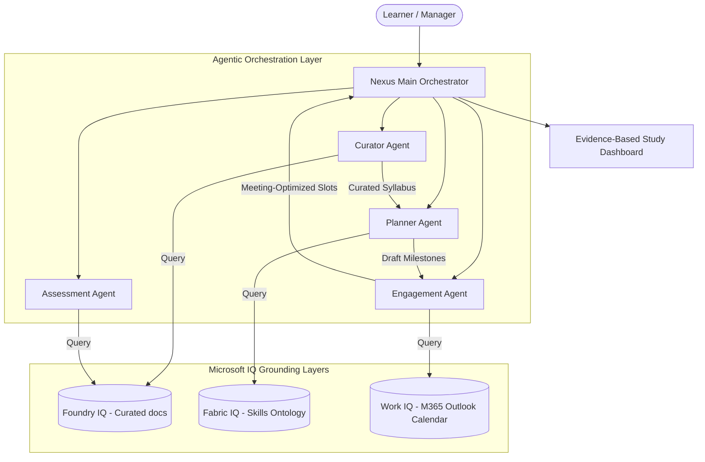

# Nexus Learning Orchestrator (Microsoft Foundry Agents)

**Nexus Learning Orchestrator** is a multi-agent workforce training optimizer built for Microsoft's "Reasoning Agents with Microsoft Foundry" challenge. It optimizes internal certification paths by orchestrating specialized agents grounded in corporate data, semantic structures, and actual calendar schedules.

This project uses a **Zero-Dependency Offline-First Architecture** to allow judges to run the full application and inspect complex agent reasoning loops without requiring active cloud credentials or Azure API keys.

---

## 🏗️ Multi-Agent Architecture

The core of the system is a **Planner-Executor-Critic** multi-agent pipeline:



### Specialized Agent Roles
1. **Curator Agent (Foundry IQ Grounding):** Maps target certifications to skills and retrieves sections from synthetic corporate documents. It ensures all recommendations include exact citations.
2. **Planner Agent (Fabric IQ Semantic Layer):** Computes skill gaps between the learner's current proficiency and target levels to generate weekly study milestones.
3. **Engagement Agent (Work IQ Calendar Integration):** Scans the learner's weekly meeting load and Outlook calendar free slots to schedule study sessions without causing meeting fatigue.
4. **Assessment Agent:** Generates practice questions cited from source materials, evaluates candidate readiness, and updates progress in the Fabric IQ ontology.
5. **Manager Insights Agent:** Aggregates team metrics (study hours, pass rates) and flags capacity bottlenecks (e.g., meeting overload risks).

---

## 🛡️ Synthetic Data Compliance (Required)
This application operates **strictly** using fabricated demonstration data to ensure privacy:
- Identifiers: `L-1001`, `EMP-001`, `TEAM-A`.
- Employee Profiles: Arsalan Khan, Zainab Fatima, Hamza Ali (all completely fictional names and credentials).
- Files: Synthetic engineering guides, workload insights, and training summaries located in the `data/` folder.

---

## ⚙️ Setup & Local Running

### Prerequisites
- Python 3.10+ installed

### Step 1: Clone and Navigate
```powershell
cd c:\Users\PMLS\Desktop\agent
```

### Step 2: Initialize Virtual Environment (Recommended)
```powershell
python -m venv .venv
# On Windows
.venv\Scripts\activate
# On macOS/Linux
source .venv/bin/activate
```

### Step 3: Install Dependencies
```powershell
pip install -r requirements.txt
```

### Step 4: Run the Application
```powershell
python run.py
```
*The script will automatically start a local server at http://127.0.0.1:8000`` and open it in your default web browser.*

---

## ⚡ Live API Toggle (Optional)
If you wish to test with live OpenAI LLM execution, enable **"Live API Mode"** in the top-right corner of the dashboard header and input your OpenAI API Key.